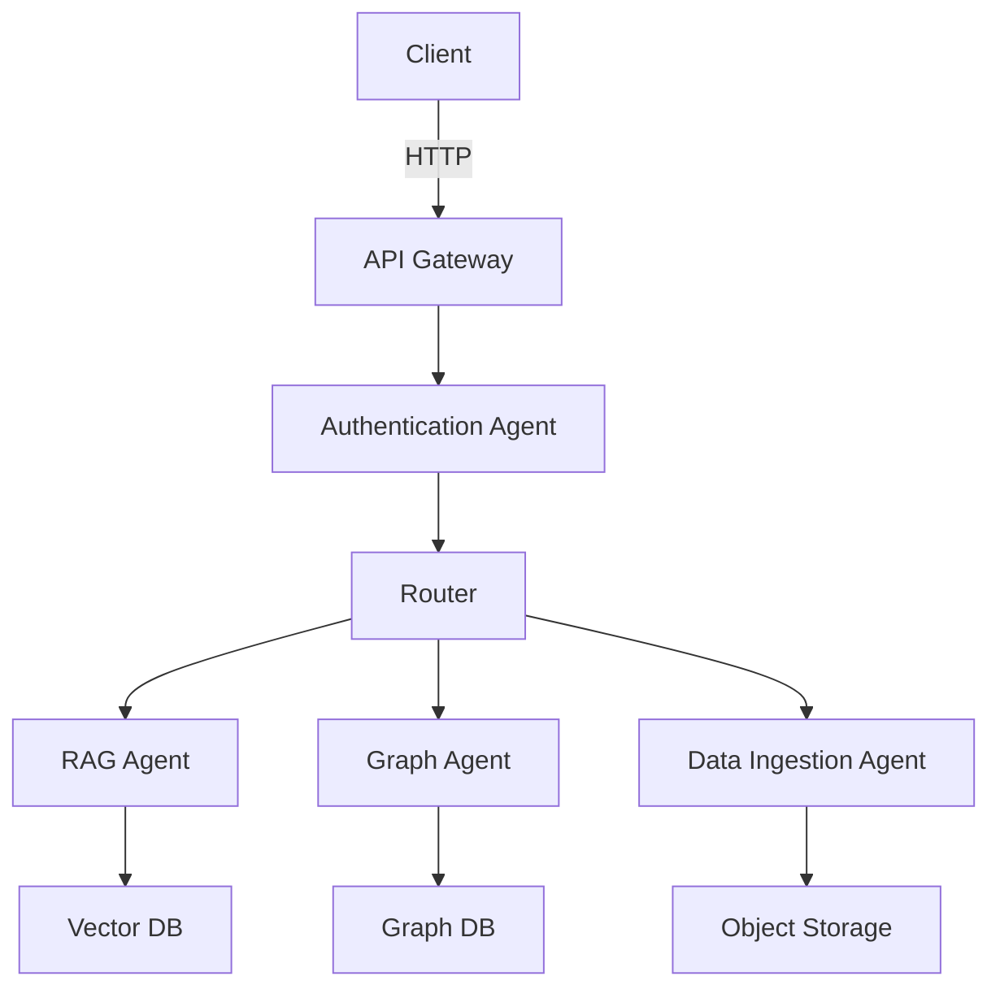

# OpenDiscourse Agent Architecture

This document outlines the agent-based architecture of OpenDiscourse, including the different types of agents, their responsibilities, and configuration options.

## Table of Contents
- [Agent Types](#agent-types)
- [Agent Communication](#agent-communication)
- [Configuration](#configuration)
- [Security](#security)
- [Monitoring](#monitoring)
- [Troubleshooting](#troubleshooting)

## Agent Types

### 1. Core Agents

#### 1.1 Authentication Agent
- **Purpose**: Handles user authentication and authorization
- **Dependencies**: Supabase Auth, JWT
- **Configuration**:
  ```env
  AUTH_ENABLED=true
  AUTH_PROVIDER=supabase
  JWT_SECRET=your-secret-key
  ```

#### 1.2 Data Ingestion Agent
- **Purpose**: Processes and indexes incoming documents
- **Dependencies**: Weaviate, MinIO
- **Configuration**:
  ```env
  INGESTION_DIR=/data/ingest
  VECTOR_DB_URL=http://weaviate:8080
  STORAGE_ENDPOINT=minio:9000
  ```

### 2. AI Agents

#### 2.1 RAG Agent
- **Purpose**: Handles Retrieval-Augmented Generation
- **Dependencies**: LocalAI, Weaviate
- **Configuration**:
  ```env
  RAG_MODEL=llama2
  RAG_TEMPERATURE=0.7
  MAX_TOKENS=1024
  ```

#### 2.2 Graph Agent
- **Purpose**: Manages knowledge graph operations
- **Dependencies**: Neo4j
- **Configuration**:
  ```env
  NEO4J_URI=bolt://neo4j:7687
  NEO4J_USER=neo4j
  NEO4J_PASSWORD=your-password
  ```

## Agent Communication

Agents communicate using a combination of:
1. **REST APIs** for synchronous operations
2. **Message Queues** for asynchronous tasks
3. **Shared Database** for state management

### Message Flow



## Configuration

### Environment Variables

| Variable | Description | Default | Required |
|----------|-------------|---------|----------|
| `AGENT_ENV` | Runtime environment (dev/stage/prod) | `dev` | No |
| `LOG_LEVEL` | Logging level (debug/info/warn/error) | `info` | No |
| `MAX_WORKERS` | Maximum concurrent workers | `4` | No |
| `HEARTBEAT_INTERVAL` | Agent heartbeat interval in seconds | `30` | No |

### Configuration Files

Agents can be configured using YAML files in `$STACK_DIR/config/agents/`:

```yaml
# Example: rag_agent.yaml
model: llama2
temperature: 0.7
max_tokens: 1024
vector_db:
  url: http://weaviate:8080
  collection: documents
```

## Security

### Authentication
- All agents must authenticate using JWT tokens
- Service-to-service communication uses mutual TLS
- Sensitive configuration is stored in environment variables or secure vaults

### Authorization
- Role-based access control (RBAC) for all operations
- Fine-grained permissions at the resource level
- Audit logging for all sensitive operations

## Monitoring

### Metrics
Each agent exposes Prometheus metrics on `/metrics`:
- Request count and duration
- Error rates
- Queue lengths
- Resource utilization

### Logging
- Structured JSON logging
- Correlation IDs for tracing requests across services
- Log aggregation using Loki

## Troubleshooting

### Common Issues

#### Agent Fails to Start
1. Check logs: `docker logs <agent_container>`
2. Verify dependencies are running
3. Check configuration values

#### Authentication Failures
1. Verify JWT_SECRET matches across services
2. Check token expiration
3. Validate RBAC configuration

### Getting Help
For additional support, please open an issue on our [GitHub repository](https://github.com/yourorg/opendiscourse/issues).

## License
SPDX-License-Identifier: Apache-2.0
