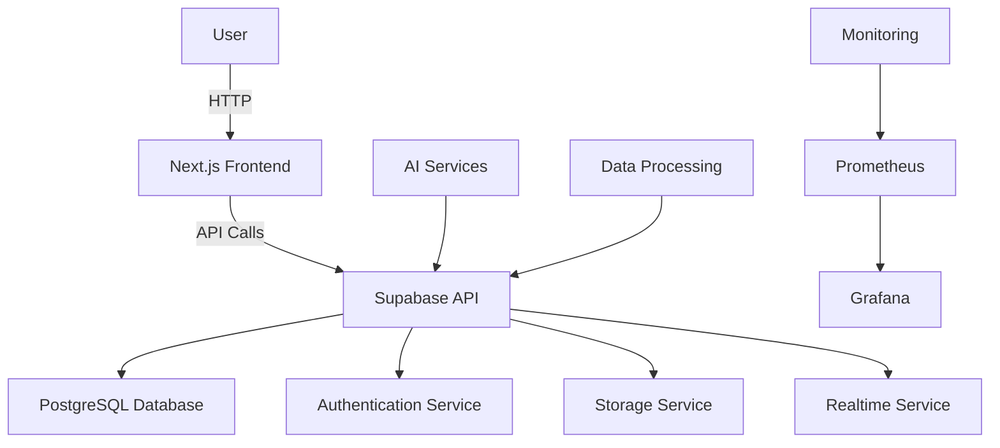

# OpenDiscourse

A comprehensive, containerized platform for discourse analysis and AI-powered content processing with Supabase self-hosting and Next.js frontend.

## Table of Contents

- [Overview](#overview)
- [Features](#features)
- [Architecture](#architecture)
- [Prerequisites](#prerequisites)
- [Quick Start](#quick-start)
- [Deployment Options](#deployment-options)
- [Project Structure](#project-structure)
- [Configuration](#configuration)
- [Development](#development)
- [Testing](#testing)
- [Monitoring](#monitoring)
- [Troubleshooting](#troubleshooting)
- [Contributing](#contributing)
- [License](#license)

## Overview

OpenDiscourse is a full-stack platform designed for advanced discourse analysis and AI-powered content processing. It combines powerful backend services with a modern web interface to provide a complete solution for processing, analyzing, and interacting with textual content.

The platform features:
- **Supabase Self-Hosting**: Full-featured Firebase alternative with PostgreSQL database, authentication, and real-time capabilities
- **Next.js Frontend**: Modern React application with Server Components, authentication, and responsive UI
- **AI Services**: Integration with LocalAI, OpenWebUI, and other AI tools
- **Data Processing**: Document ingestion, text extraction, and knowledge graph building
- **Monitoring**: Comprehensive logging and metrics with Prometheus and Grafana

## Features

### Backend Services
- **Supabase Self-Hosting**: PostgreSQL database with REST API, authentication, real-time subscriptions, and storage
- **Authentication**: Email/password signup and login with email confirmation
- **Data Management**: Row Level Security and fine-grained access control
- **File Storage**: Secure file storage with S3-compatible API
- **Real-time**: WebSocket subscriptions for live data updates

### Frontend Application
- **Next.js 14**: App Router with Server Components and Client Components
- **Authentication**: Integrated Supabase auth with session management
- **Responsive UI**: Mobile-friendly interface using Tailwind CSS
- **User Management**: Account pages for profile management
- **Modern Development**: TypeScript, ESLint, and Prettier

### AI and Data Processing
- **Document Processing**: PDF, DOCX, and TXT file processing
- **Text Analysis**: Natural language processing and entity extraction
- **Knowledge Graph**: Neo4j integration for relationship mapping
- **Vector Search**: Weaviate integration for semantic search
- **AI Assistants**: LocalAI integration for conversational AI

### Infrastructure
- **Containerization**: Docker and Docker Compose for easy deployment
- **Orchestration**: Terraform support for cloud deployments
- **Reverse Proxy**: Traefik for SSL termination and routing
- **Monitoring**: Prometheus and Grafana for metrics and logs
- **Storage**: MinIO for object storage

## Architecture



## Prerequisites

- **Docker** and **Docker Compose**
- **Node.js** >= 18.17.0
- **pnpm** package manager
- **Git**
- **curl** and **jq**
- At least **4GB RAM** and **2 CPU cores** for Supabase services

For cloud deployments:
- **Terraform** (for Proxmox VE)
- **SSH tools**

## Quick Start

### One-Click Deployment

```bash
# Clone the repository
git clone https://github.com/yourorg/opendiscourse.git
cd opendiscourse

# Run one-click deployment
./scripts/one-click-deploy.sh
```

This will:
1. Deploy Supabase services using Docker Compose
2. Set up the Next.js application
3. Build the Next.js application
4. Show deployment status and access information

### Access the Applications

- **Supabase Studio**: http://localhost:3000
- **Next.js Application**: http://localhost:3001 (development server)

## Deployment Options

### 1. Supabase Self-Hosting

Deploy only the Supabase backend services:

```bash
# Generate secure environment variables
python3 scripts/generate_supabase_env.py --output supabase-docker/.env --force

# Start Supabase services
./scripts/deploy-supabase.sh start

# Check service status
./scripts/deploy-supabase.sh status
```

### 2. Next.js Application

Set up and run only the Next.js frontend:

```bash
# Install dependencies and configure the application
./scripts/setup-nextjs.sh setup

# Start development server
./scripts/setup-nextjs.sh dev
```

### 3. Full Platform Deployment

Deploy the entire platform with all services:

```bash
# One-click deployment
./scripts/one-click-deploy.sh
```

### 4. Legacy Deployment

Use the original deployment scripts:

```bash
# Install and configure the stack
sudo -E ./install.sh

# Start all services
sudo -E ./deploy.sh start
```

## Project Structure

```
opendiscourse/
├── supabase-docker/          # Supabase self-hosting Docker setup
│   ├── docker-compose.yml    # Docker Compose configuration
│   ├── .env                  # Environment variables
│   └── volumes/              # Persistent data volumes
├── nextjs/                   # Next.js web application
│   ├── app/                  # App Router pages and components
│   ├── utils/                # Utility functions
│   ├── public/               # Static assets
│   └── package.json          # Dependencies and scripts
├── scripts/                  # Deployment and management scripts
│   ├── deploy-supabase.sh    # Supabase deployment script
│   ├── setup-nextjs.sh       # Next.js setup script
│   ├── one-click-deploy.sh   # One-click deployment script
│   └── generate_supabase_env.py # Supabase env generator
├── tests/                    # Test suite
│   ├── unit/                 # Unit tests
│   ├── integration/          # Integration tests
│   └── e2e/                  # End-to-end tests
├── monitoring-stack/         # Monitoring services
├── terraform/                # Terraform configurations
└── documentation/
    ├── README.md             # This file
    ├── TASKS.md              # Task definitions
    ├── AGENTS.md             # Agent architecture
    └── QWEN.md               # Project context
```

## Configuration

### Environment Variables

The platform uses environment variables for configuration:

1. **Supabase Configuration** (`supabase-docker/.env`):
   - Database passwords and connection settings
   - JWT secrets and API keys
   - Service ports and URLs
   - Email and SMTP settings

2. **Next.js Configuration** (`nextjs/.env.local`):
   - Supabase URL and anonymous key
   - Feature flags and API endpoints

### Generating Secure Configuration

The platform includes scripts to generate secure environment variables:

```bash
# Generate Supabase .env file
python3 scripts/generate_supabase_env.py --output supabase-docker/.env --force

# Generate application .env file
python3 scripts/generate_env.py --domain opendiscourse.net --email blaine.winslow@gmail.com --force
```

## Development

### Supabase Development

```bash
# Start Supabase services
./scripts/deploy-supabase.sh start

# View logs
./scripts/deploy-supabase.sh logs

# Stop services
./scripts/deploy-supabase.sh stop
```

### Next.js Development

```bash
# Install dependencies
cd nextjs
pnpm install

# Start development server
pnpm run dev

# Build for production
pnpm run build

# Start production server
pnpm run start
```

### Code Structure

#### Next.js Application

- **App Router**: Pages are in `nextjs/app/` directory
- **Components**: Reusable UI components in `nextjs/components/`
- **Utilities**: Helper functions in `nextjs/utils/`
- **Styles**: Global styles in `nextjs/app/globals.css`

#### Supabase Integration

- **Client**: `nextjs/utils/supabase/client.js` for browser usage
- **Server**: `nextjs/utils/supabase/server.js` for server components
- **Middleware**: `nextjs/utils/supabase/middleware.js` for auth handling

## Testing

The platform includes a comprehensive test suite:

```bash
# Run unit tests
python -m pytest tests/unit/

# Run integration tests
python -m pytest tests/integration/

# Run end-to-end tests
python -m pytest tests/e2e/

# Run all tests
python -m pytest tests/
```

### Test Structure

- **Unit Tests**: Individual function and component testing
- **Integration Tests**: Service interaction testing
- **End-to-End Tests**: Complete workflow testing

## Monitoring

### Supabase Monitoring

Supabase services include built-in health checks and logging:

```bash
# View Supabase service status
./scripts/deploy-supabase.sh status

# View Supabase logs
./scripts/deploy-supabase.sh logs
```

### Platform Monitoring

The platform includes Prometheus and Grafana for metrics and monitoring:

- **Prometheus**: Metrics collection
- **Grafana**: Dashboard and alerting

## Troubleshooting

### Common Issues

#### Supabase Services Not Starting

1. Check Docker and Docker Compose installation
2. Verify environment variables in `supabase-docker/.env`
3. Check available system resources
4. Review logs: `./scripts/deploy-supabase.sh logs`

#### Next.js Development Server Not Starting

1. Ensure Node.js and pnpm are installed
2. Check dependencies: `cd nextjs && pnpm install`
3. Verify environment variables in `nextjs/.env.local`
4. Check for port conflicts

#### Authentication Issues

1. Verify Supabase ANON_KEY and SERVICE_ROLE_KEY
2. Check JWT_SECRET consistency between services
3. Ensure user has proper permissions
4. Review Supabase auth configuration

### Getting Help

For additional support:
1. Check the logs for error messages
2. Review the documentation
3. Open an issue on our [GitHub repository](https://github.com/yourorg/opendiscourse/issues)

## Contributing

We welcome contributions to OpenDiscourse! Please follow these steps:

1. Fork the repository
2. Create a feature branch
3. Make your changes
4. Add tests if applicable
5. Update documentation
6. Submit a pull request

### Development Guidelines

- Follow the existing code style
- Write tests for new features
- Update documentation for API changes
- Keep commits focused and atomic
- Use descriptive commit messages

## License

This project is licensed under the Apache License 2.0 - see the [LICENSE](LICENSE) file for details.

SPDX-License-Identifier: Apache-2.0