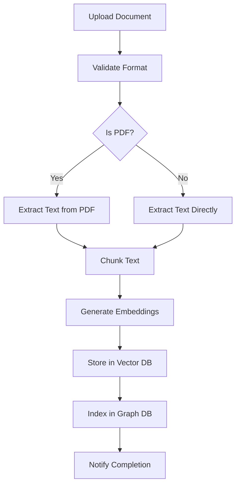
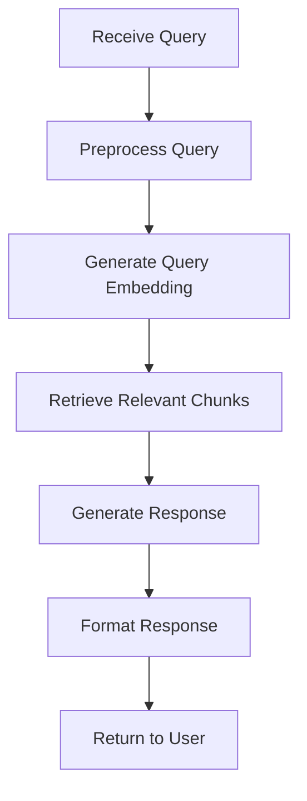

# OpenDiscourse Task Definitions and Workflows

This document outlines the various tasks and workflows that power the OpenDiscourse platform.

## Table of Contents
- [Task Types](#task-types)
- [Workflow Definitions](#workflow-definitions)
- [Task Configuration](#task-configuration)
- [Error Handling](#error-handling)
- [Monitoring and Logging](#monitoring-and-logging)
- [Performance Considerations](#performance-considerations)

## Task Types

### 1. Document Processing Tasks

#### 1.1 Document Ingestion
- **Description**: Processes uploaded documents (PDF, DOCX, TXT)
- **Input**: File path or binary data
- **Output**: Extracted text and metadata
- **Dependencies**: Tesseract (for OCR), PyPDF, python-docx

#### 1.2 Text Extraction
- **Description**: Extracts structured content from raw text
- **Input**: Raw text content
- **Output**: Structured data (tables, lists, paragraphs)
- **Dependencies**: spaCy, regex

### 2. AI Processing Tasks

#### 2.1 Embedding Generation
- **Description**: Generates vector embeddings for text chunks
- **Input**: Text chunks
- **Output**: Vector embeddings
- **Dependencies**: Sentence Transformers, Weaviate

#### 2.2 Query Processing
- **Description**: Processes user queries and retrieves relevant content
- **Input**: Natural language query
- **Output**: Relevant document chunks and metadata
- **Dependencies**: Weaviate, RAG model

## Workflow Definitions

### Document Processing Workflow



### Query Processing Workflow



## Task Configuration

### Task Queue Configuration

```yaml
queues:
  default:
    concurrency: 4
    max_retries: 3
    retry_delay: 60
  
  high_priority:
    concurrency: 8
    max_retries: 5
    retry_delay: 30

  low_priority:
    concurrency: 2
    max_retries: 1
    retry_delay: 300
```

### Task Timeouts

| Task Type | Timeout (seconds) |
|-----------|-------------------|
| Document Processing | 300 |
| Embedding Generation | 120 |
| Query Processing | 60 |
| Background Tasks | 600 |

## Error Handling

### Retry Logic
- **Max Retries**: 3 (configurable)
- **Backoff**: Exponential (1s, 2s, 4s)
- **Dead Letter Queue**: Failed tasks after max retries

### Common Errors

| Error Code | Description | Resolution |
|------------|-------------|------------|
| 4001 | Invalid document format | Check file type and content |
| 5001 | Processing timeout | Increase timeout or optimize task |
| 5002 | Resource not available | Check service dependencies |

## Monitoring and Logging

### Metrics
- Task queue length
- Processing time
- Success/failure rates
- Retry counts

### Logging
- Task start/end times
- Input/output samples (redacted)
- Error details
- Performance metrics

## Performance Considerations

### Optimization Techniques
- Batch processing for multiple documents
- Caching frequent queries
- Asynchronous processing for long-running tasks
- Horizontal scaling for high-load scenarios

### Resource Requirements

| Task Type | CPU | Memory | Storage |
|-----------|-----|--------|---------|
| Document Processing | Medium | High | Low |
| Embedding Generation | High | High | Low |
| Query Processing | Low | Medium | Low |
| Background Tasks | Low | Low | Medium |

## Deployment

### Container Resources

```yaml
resources:
  requests:
    cpu: "2"
    memory: "4Gi"
  limits:
    cpu: "4"
    memory: "8Gi"
```

### Horizontal Pod Autoscaling

```yaml
autoscaling:
  enabled: true
  minReplicas: 2
  maxReplicas: 10
  targetCPUUtilizationPercentage: 70
  targetMemoryUtilizationPercentage: 80
```
