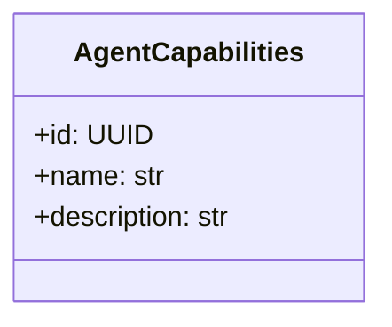
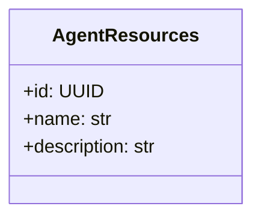
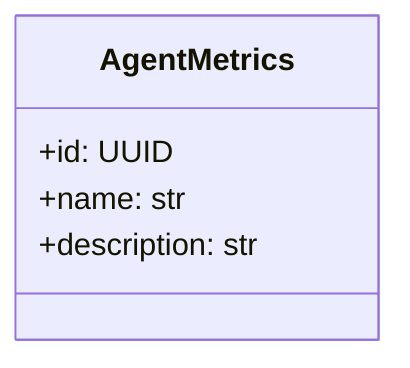

# Data Models

## AgentCapabilities

```mermaid
classDiagram
    class AgentCapabilities {
        +id: UUID
        +name: str
        +description: str
    }
```
## AgentResources

```mermaid
classDiagram
    class AgentResources {
        +id: UUID
        +name: str
        +description: str
    }
```
## AgentMetrics

```mermaid
classDiagram
    class AgentMetrics {
        +id: UUID
        +name: str
        +description: str
    }
```
...